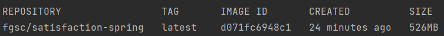
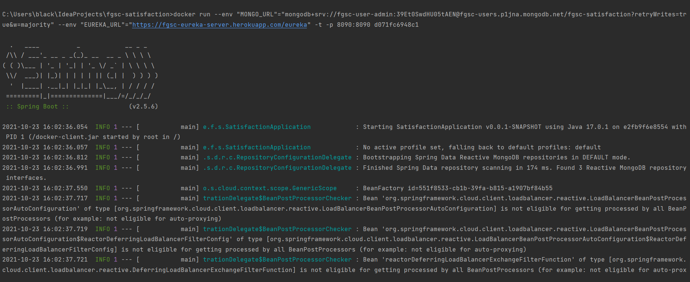

docker run --env "MONGO_URL"="mongodb+srv://fgsc-user-admin:<password>@fgsc-users.p1jna.mongodb.net/fgsc-satisfaction?retryWrites=tr
ue&w=majority" --env "EUREKA_URL"="https://fgsc-eureka-server.herokuapp.com/eureka" -t -p 8090:8090 d071fc6948c1

result docker:
